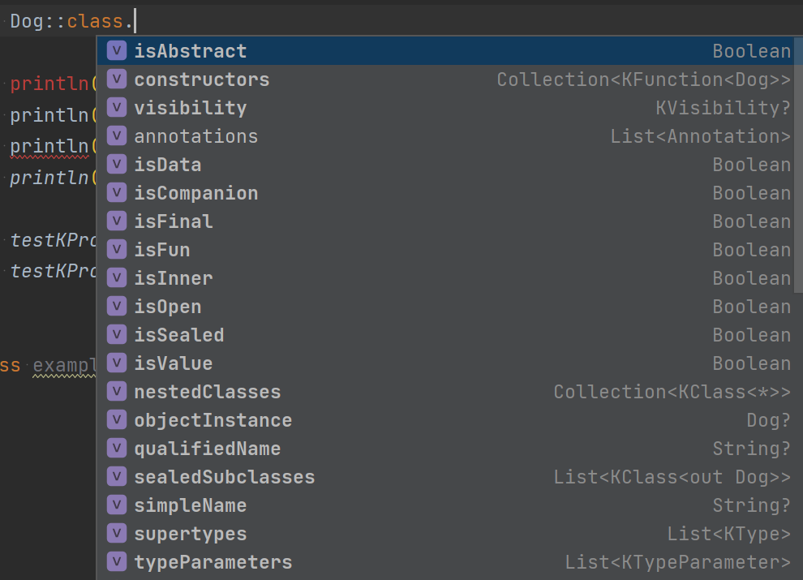

# 리플렉션(Reflection)

리플렉션은 런타임에 객체의 프로퍼티와 메서드에 접근할 수 있게 해주는 방법이다.  

다음과 같은 경우 리플렉션을 사용한다.  
* 타입과 관계없이 객체를 다뤄야 할 경우
* 객체가 제공하는 메서드나 프로퍼티 이름을 런타임이 되었을 때 알 수 있는 경우

예) JSON 직렬화 라이브러리, 스프링 DI 등

<br><br>

> 코틀린에서 리플렉션을 다룰 때는 kotlin-reflect.jar 의존성을 추가해줘야 한다.

---

## Class 레퍼런스
클래스에 대한 정보를 클래스 레퍼런스라고 표현한다.
`::` 연산자와 class 리터럴을 사용해서 (`::class`) 코틀린 클래스에 대한 레퍼런스를 얻을 수 있다.

클래스 레퍼런스의 타입은 `KClass` 로 표현한다.

```kotlin
val str = "hello"
val strClass = str::class // 클래스 레퍼런스

println(strClass.simpleName) // String

```

---

클래스 레퍼런스(`KClass`) 통해 클래스의 정보들을 얻을 수 있다.  
클래스가 Abstract 인지, Final 인지, 멤버 프로퍼티는 무엇인지 등등

```kotlin
abstract class Animal(val name: String)
class Cat(name: String) : Animal(name)

fun main() {
    val animalKClass = Animal::class
    val catKClass = Cat::class

    println(animalKClass.isAbstract) // true
    println(catKClass.isAbstract) // false
    println(animalKClass.declaredMemberProperties) // [val ch10.Animal.name: kotlin.String]
    println(catKClass.isSubclassOf(animalKClass)) // true
}
```

---
## 메서드 레퍼런스
메서드에 대한 정보를 메서드 레퍼런스라고 한다.
메서드 레퍼런스도 `::` 연산자로 얻는다.
- 최상위 메서드 - `::메서드명`
- 멤버 메서드 - `클래스명::메서드명`

메서드 레퍼런스의 타입은 `KFunction` 이다.

---

메서드 레퍼런스로 메서드의 여러 정보들을 확인할 수 있다.

```kotlin
fun echo(str: String) {
    println(str)
}

fun main() {
    val echoMethod = ::echo

    println(echoMethod) // fun echo(kotlin.String): kotlin.Unit
    println(echoMethod.visibility) // PUBLIC
    println(echoMethod.returnType) // kotlin.Unit
    println(echoMethod.parameters[0].name) // str
}
```

---

## 프로퍼티 레퍼런스
프로퍼티 레퍼런스도 `::` 연산자로 얻을 수 있다.
- 최상위 프로퍼티 - `::프로퍼티명`
- 멤버 프로퍼티 - `클래스명::프로퍼티명`
- 확장 프로퍼티 - `리시버타입::프로퍼티명`

이를 통해 런타임에 프로퍼티에 대한 정보들을 확인할 수 있다.

---
### 프로퍼티 레퍼런스 얻기


---
### KProperty, KMutableProperty
프로퍼티 레퍼런스는 두가지 타입으로 표현한다.
val로 선언한 프로퍼티는 KProperty로,
var로 선언한 프로퍼티는 KMutableProperty로 표현한다.

<br>

**Kotlin REPL 실행 결과**
```kotlin
val x = 1
var y = 1

::x
res1: kotlin.reflect.KProperty0<kotlin.Int> = val Line_0.x: kotlin.Int

::y
res2: kotlin.reflect.KMutableProperty0<kotlin.Int> = var Line_0.y: kotlin.Int
```

---

Kotlin REPL
```kotlin
val x = 1    // KProperty
var y = 1    // KMutableProperty

// ::x.set(2) // 불가능. KProperty 에는 해당 메서드가 없음
::y.set(2) 

println(y)
2 

```

---

## Callable 레퍼런스
메서드 레퍼런스, 프로퍼티 레퍼런스를 포괄적으로 가리킬 때는 
**Callable 레퍼런스**라고 표현할 수도 있다.

메서드 레퍼런스의 타입 - `KFunction`, 프로퍼티 레퍼런스 타입 - `KProperty`

모두 `KCallable` 인터페이스의 하위 인터페이스 이기 때문이다.

```kotlin
interface KCallable<out R> {
    fun call(vararg args: Any?) : R
    ...
}
```
```
interface KFunction<out R> : KCallable<R>, Function<R>
```
```
interface KProperty<out V> : KCallable<V>
```
---

메서드 레퍼런스는 Callable 레퍼런스의 하위 타입이기 때문에 
메서드레퍼런스.call() 를 통해 메서드를 호출할 수 있다.

```kotlin
fun echo(str: String) {
    println(str)
}

fun main() {
    val echoMethod = ::echo

    echoMethod.invoke("hello")
    echoMethod.call("hello")
}
```

---
프로퍼티 레퍼런스도 call 메서드를 호출할 수 있다.
```kotlin
var x = 1
println(::x.get()) // 1
println(::x.call()) // 1, 프로퍼티의 getter를 호출
```
