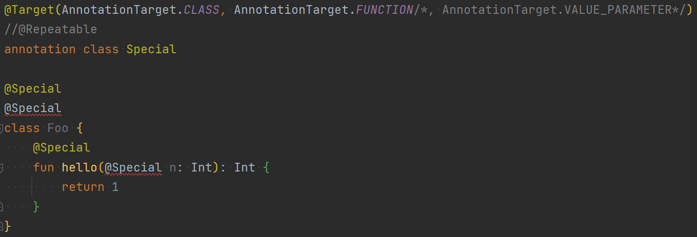
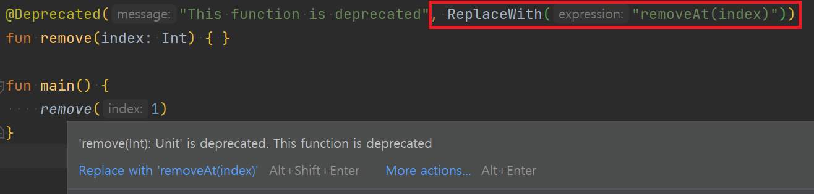

# 애노테이션(Annotation)

애노테이션이란 클래스나 메서드 등 코드에 추가적인 의미를 부여하는 방법이다.  
컴파일 시점이나 런타임 시점에 부가적인 처리를 해야할 때 애노테이션을 사용할 수 있다.

### 애노테이션 선언
애노테이션을 선언하려면 `annotation`을 클래스 앞에 붙여준다.
```kotlin
annotation class Special
```

---

## 메타-애노테이션
애노테이션 클래스에 적용할 수 있는 애노테이션이다.  
해당 애노테이션을 어떻게 처리할지 제어하는 데 사용한다.

```kotlin
@Target(AnnoationTarget.CLASS)
annotation class Special
```

메타-애너테이션에는 @Target, @Retention, @Repeatable, @MustBeDocumented 가 있다.

---

### 메타-애너테이션 종류 (1/2)
`@Target`  
어떤 요소(클래스, 함수, 프로퍼티, 파라미터 등)에 적용할 수 있는지 지정한다.  
지정하지 않을 경우 모든 요소에 적용할 수 있는 애노테이션이 된다.  

`@Retention`  
애너테이션을 소스 수준에서만 유지할 지, 컴파일한 클래스에 저장할 지, 런타임에 리플렉션을 사용해서 접근할 수 있게 할지를 지정한다.  
기본 값은 런타임 시점까지 유지할 수 있도록 한다.

---
### 메타-애너테이션 종류 (2/2)
`@Repeatable`  
한 요소에 애노테이션이 중복으로 사용될 수 있는지를 나타낸다.

`@MustBeDocumented`  
생성한 API 문서에 해당 Annotation 도 포함될 수 있는지를 나타낸다.  
Library 를 만들 때 사용한다.  

---

## 애노테이션 적용하기
```kotlin
@Target(AnnoationTarget.CLASS, AnnotationTarget.FUNCTION, AnnotationTarget.VALUE_PARAMETER)
@Repeatable
annotation class Special

@Special
@Special
class Foo {
    @Special
    fun hello(@Special n: Int): Int {
        return 1
    }
}
```

---

@Target 에 AnnotationTarget.VALUE_PARAMETER 을 지정하지 않았다면?  
@Repeatable 이 없다면?  




---

## 애노테이션 파라미터
파라미터가 있는 애노테이션을 정의하려면 주 생성자에 파라미터를 선언해야한다.  

```kotlin
annotation class Special(val why: String)

@Special("secret") class Foo {}
```

---

### 애너테이션 파라미터가 될 수 있는 타입
- Int, Long 등 원시 타입 값
- 문자열
- Enum
- **다른 애노테이션**
- **클래스 (Foo::class)**
- 위에서 열거한 타입의 배열

---

### 애노테이션 파라미터로 애노테이션 사용하기
어떤 애노테이션의 파라미터로 애노테이션을 사용할 경우,  
해당 애노테이션의 이름에 @ 문자를 붙이지 않고 인자로 넘겨준다.  



---

### 애노테이션 파라미터로 클래스 사용하기
애노테이션의 파라미터로 클래스를 사용하려면 코틀린 클래스(`KClass`)를 사용한다.  
`KClass`는 코틀린 클래스의 레퍼런스를 저장하는 타입이다.  

파라미터 타입에 `KClass<허용할 클래스 이름>`을 쓴다.  
```kotlin
import kotlin.reflect.KClass

annotation class Special(val arg1: KClass<Animal>)

@Special(Animal::class) class MyClass
```

---

### 애노테이션 파라미터로 제네릭 클래스 사용하기
애노테이션 인자로 제네릭 클래스를 받으려면 `KClass<허용할 제네릭 클래스 이름<*>>`처럼 허용할 제네릭 클래스의 이름 뒤에 스타 프로젝션을 덧붙인다.  

```kotlin
abstract class Box<T>(val t: T)
class StrBox : Box<String>("hello")

annotation class SpecialBox(val arg1: KClass<out Box<*>>)

@SpecialBox(StrBox::class) class CustomClass
```

> 허용할 클래스의 하위 클래스까지 모두 허용해주려면
> `KClass<out KClass<Box<*>>>` 처럼 out 키워드로 상한(upper bound)을 지정한다.

---

## 애노테이션 사용 지점 대상 (use-site target)
코틀린 코드가 바이트 코드로 변환되었을 때 여러가지 요소에 대응하는 경우,  (ex. 프로퍼티)
정확히 어떤 부분에 애노테이션을 적용할 지 지정 할 수 있다.
이를 애노테이션 사용 지점 대상(`use-site target`)이라 한다.

사용 지점 대상 문법
![[use-site-target.png]]

---

### 지원하는 사용 지점 대상
- file
- property (자바에서 선언된 애노테이션에서는 이 사용 지점 대상을 사용할 수 없다.)
- field
- get (프로퍼티 getter)
- set (프로퍼티 setter)
- receiver (확장 함수나 프로퍼티의 리시버 파라미터)
- param (생성자 파라미터)
- setparam (프로퍼티 setter의 파라미터)
- delegate (위임 프로퍼티의 위임 인스턴스를 담아둔 필드)

---
#### @file:JvmName
`@JvmName` 은 코틀린이 바이트코드로 변환될 때 만들어지는 이름을 변경하는 용도로 사용한다.

코틀린 클래스 파일은 바이트코드로 변환되었을 때 자동으로 -kt.class 형태의 파일이 만들어진다.

`@file:JvmName`  을 사용하면 ExampleKt.class 대신 원하는 이름의 클래스로 만들 수 있다.

```kotlin
@file:JvmName("Example") // Example.class 

package com.kotlin.demo

...
```

---

```kotlin
class Example(@field:Ann val foo,    // annotate Java field
              @get:Ann val bar       // annotate Java getter
```

```java
// java
public final class Example {
   @Ann
   @NotNull
   private final String foo;
   @NotNull
   private final String bar;
   

   @NotNull
   public final String getFoo() {
      return this.foo;
   }

   @Ann
   @NotNull
   public final String getBar() {
      return this.bar;
   }

   @NotNull
   public final String getQuux() {
      return this.quux;
   }
   ...
}
```

---
아래는 부가적인 내용


> 변성에는 무공변성, 공변성, 반공변성이 존재한다.
> (variance - invariance / covariance / contravariance)
> 
> 코틀린의 제네릭의 타입은 기본적으로 무공변(Invariance)인데, 
> in/out 키워드로 변성(variance)을 변경할 수 있다.

> **out** 
>  `<out Animal>` 은 
>   `Special<Animal>`이 `Special<Cat>`의 super class가 되도록 정의하는 것이다.
> (Animal - Cat 타입의 상속 관계를 제네릭의 상속 관계에도 똑같이 적용, 공변성)

---

References

* Kotlin in action
* [Annotations | Kotlin (kotlinlang.org)](https://kotlinlang.org/docs/annotations.html#annotation-use-site-targets)
* [Kotlin - Generics 클래스, 함수를 정의하는 방법 (codechacha.com)](https://codechacha.com/ko/generics-class-function-in-kotlin/)

